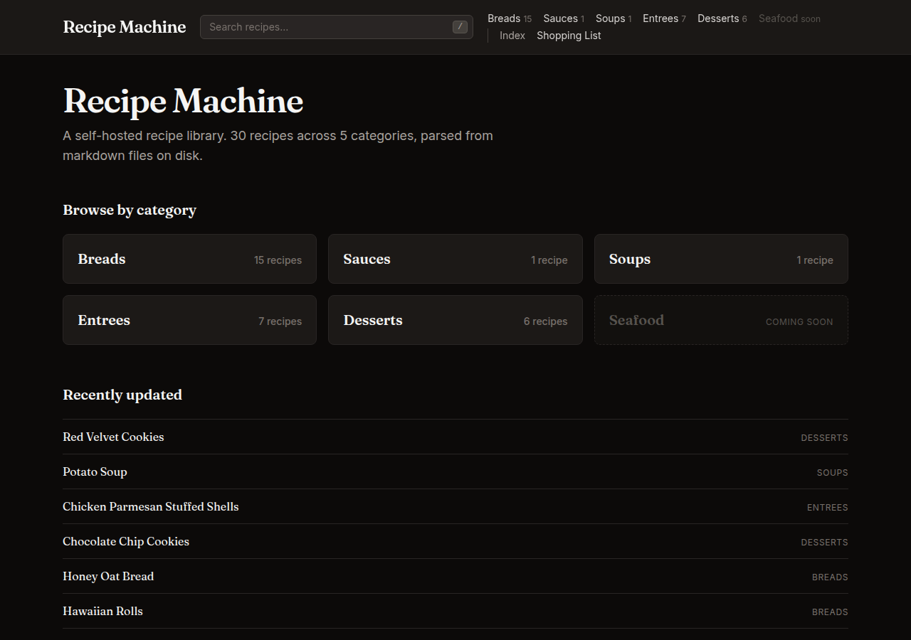
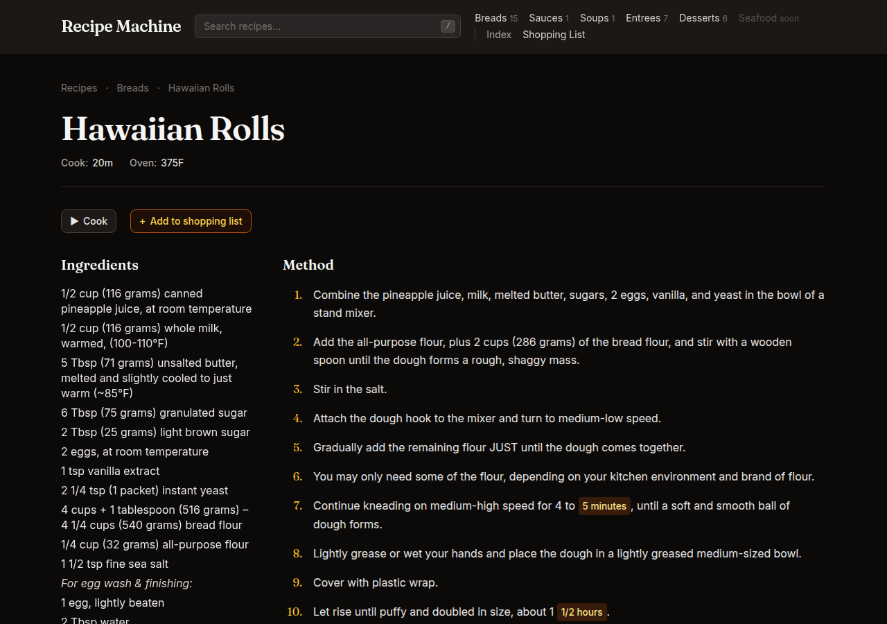
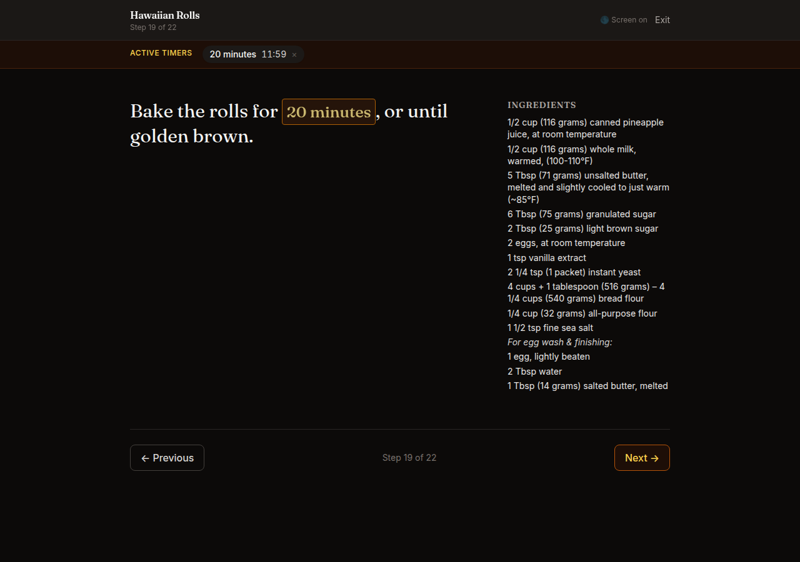
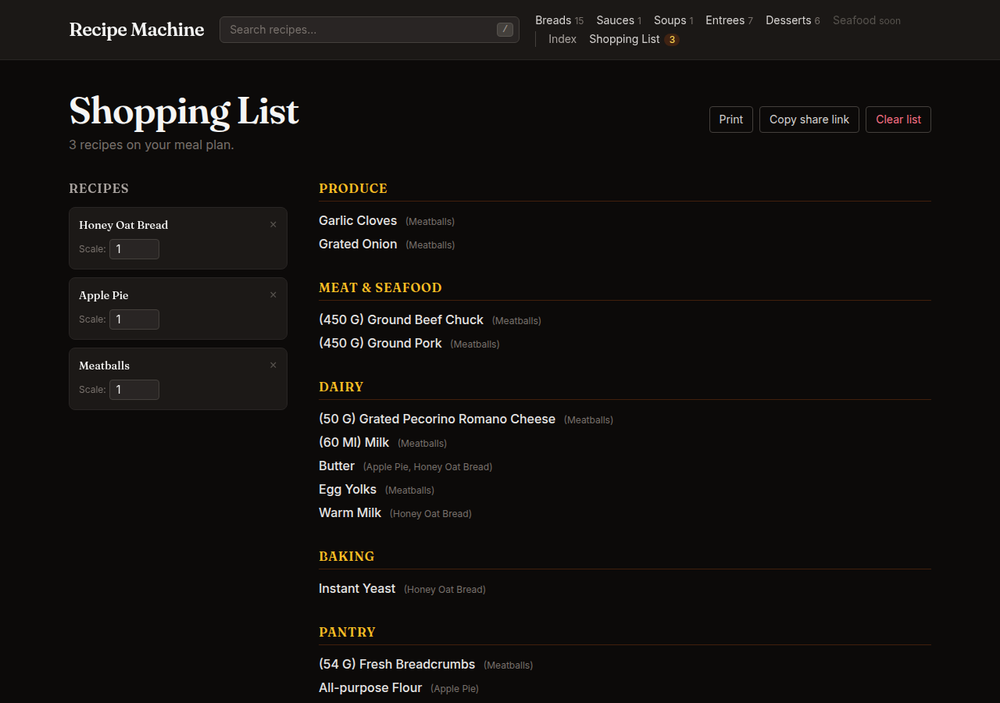
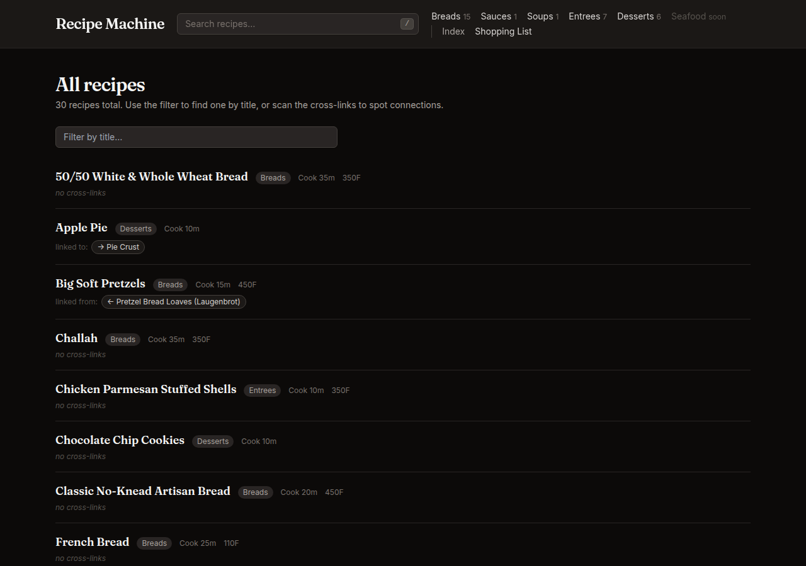
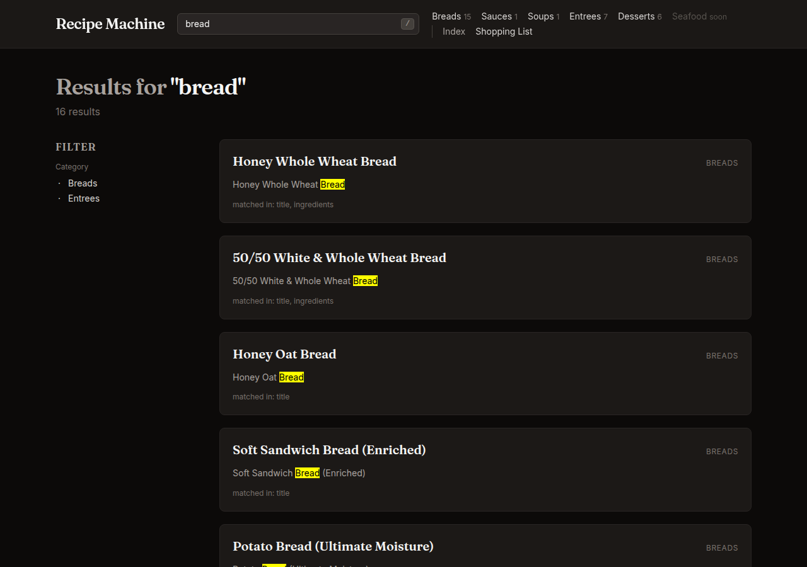

# Recipe Machine

> A self-hosted recipe library that turns a directory of markdown
> files into a searchable, scalable, shopping-list-generating web
> app. Designed for the home LAN.



## What this is

Recipe Machine started as a personal pain point. A few dozen
recipes lived as markdown in a private repo — perfect for editing
in `$EDITOR` and version-controlling, but unfriendly for any other
use: no scaling for guests, no shopping list when meal-planning,
no full-text search, no "what was that bread I made last fall."
Browsers want HTML, not folders of `.md` files.

So this is the smallest possible thing that fixes that: a
single-container web app that **treats the markdown files as the
source of truth** and the SQLite database as a cache built from
them. You edit recipes in your editor of choice, run `make
reindex`, and the web UI catches up. No CMS, no admin panel, no
"edit recipe" form. The DB never owns anything the markdown
doesn't.

Where the rules-based ingredient parser falls down — and recipes
in the wild are full of edge cases — there's an
[opt-in LLM fallback](docs/llm-fallback.md) that routes the
remainder through Claude Haiku, caches results forever, and never
phones home at request time.

## What it does

- **Browse** by category, search across titles + ingredients +
  method + notes (FTS5).
- **Scale** any recipe up or down. The math respects fractions,
  rounds count-nouns ("3 eggs × 1.5 → ~5 eggs"), and the same
  formatter runs in both PHP and JS — verified by a parity test.
- **Shopping list** across multiple recipes at once with
  aggregation by aisle (produce, dairy, baking, pantry, …),
  unit-class conversion, and a shareable URL.
- **Cooking mode** — distraction-free big-text view, tappable
  timer phrases that start countdowns, Wake Lock to keep the
  screen on, sessionStorage-backed step bookmark.
- **Cross-linking** — explicit `[[recipe-slug]]` references plus
  auto-detection of bare titles in notes prose, plus a Jaccard-
  similarity "Similar recipes" section, plus an [/recipes index
  page](docs/screenshots/recipes-index.png) that visualizes the
  whole cross-link graph for the maintainer.

## Screenshots

### Recipe detail page — Hawaiian Rolls


Timer phrases and temperatures get visually distinct pills.
Ingredients sub-group by `### Headers`. Sections that aren't
present (libation, notes) just don't render.

### Cooking mode with a running timer


One step at a time, large type. Tap a timer phrase to start it;
the active-timers stripe shows the countdown across step
navigation. Wake Lock keeps the phone screen on; sessionStorage
remembers where you were if the page reloads.

### Shopping list — three recipes aggregated


Add multiple recipes, optionally at different scales, and they
aggregate into one ordered list grouped by aisle. The "(Apple Pie,
Honey Oat Bread)" tag in parentheses shows which recipes
contributed each line.

### Cross-link index page


A maintainer's view of every recipe and its outgoing/incoming
cross-references. Useful for spotting "isolated" recipes that
could use a `[[ref]]`.

### Search results


FTS5 across title, ingredient lines, method text, and notes.
Sub-second on this corpus.

## Architecture

```
recipes/*.md  →  RecipeParser  →  SQLite cache  →  Web UI
   (canonical)    (rules-first)     (FTS5 +          (Laravel + Alpine)
                       ↓             see-also)
                   IngredientLLMParser  →  ingredient_llm_cache
                   (Phase 9, opt-in)        (hits permanent,
                                              misses 30-day TTL)
```

- **Parser-first**: every recipe goes through `RecipeParser` first.
  Rules-based, deterministic, no external dependencies. Most lines
  parse cleanly.
- **LLM fallback**: lines the rules-based parser can't structure
  (section headers, parentheticals, unconventional phrasings) get
  routed to Claude Haiku as a batch. Results live forever in
  `ingredient_llm_cache`; misses tombstone for 30 days so future
  model improvements get picked up. The fallback is **indexer-only**
  — no live API calls during page rendering.
- **Cache, not source**: `make reindex` truncates and rebuilds the
  whole SQLite database from the markdown. You can delete
  `database/database.sqlite` and lose nothing material.
- **Self-hosted**: one Docker container, one SQLite file, the
  recipes/ directory mounted in. No external services required
  unless you opt in to the LLM fallback.

More detail: [docs/llm-fallback.md](docs/llm-fallback.md) for the
LLM architecture, [docs/recipe-format.md](docs/recipe-format.md)
for the markdown spec.

## Running it yourself

The intended deployment is your own LAN — a Raspberry Pi, a NAS, a
spare laptop, whatever can run Docker. There's no public-deployment
story; the app has no auth and treats every visitor as
fully-privileged.

**Prerequisites:** Docker + Docker Compose.

**First boot:**

```sh
git clone https://github.com/kbennett2000/recipe-machine.git
cd recipe-machine
cp .env.example .env
touch database/database.sqlite     # required for the bind mount
make rebuild                       # build + boot + migrate
make reindex                       # parse recipes/ into the cache
```

Open <http://localhost:8000>. To access from other devices on the
LAN, replace `localhost` with the host's LAN IP (e.g.
`http://192.168.1.42:8000`).

**Add a recipe:**

```sh
$EDITOR recipes/desserts/your-recipe.md
make reindex
```

See [docs/recipe-format.md](docs/recipe-format.md) for the
markdown format. It's deliberately permissive — frontmatter
fields are mostly optional, ingredient lines have many parseable
forms, and unparsed lines just render italicized instead of
breaking the page.

**Enable the LLM fallback (optional):**

Set in `.env`:

```env
RECIPE_MACHINE_LLM_FALLBACK=true
ANTHROPIC_API_KEY=sk-ant-...
```

Then `docker compose exec app php artisan recipes:reindex --with-llm`.

Cost is ~$0.013 per 30-recipe corpus pass (Claude Haiku pricing).
Subsequent reindexes hit the cache for free.

## The recipe format

Frontmatter + standard markdown sections. The
[full spec](docs/recipe-format.md) covers the details, but the
short version is:

```markdown
---
title: Honey Oat Bread
category: breads
slug: honey-oat-bread
servings: "1 loaf (~12 slices)"
yields: 12
cook_time: "40m"
oven_temp: "350F"
libation: "Semi-sweet mead—honey loves honey."
---

## Ingredients

- 3 cups flour
- 2 1/4 tsp instant yeast
- 1 1/4 cups warm milk
- Salt to taste

## Method

1. Knead, rise 1–1½ hours, shape into loaf pan, rise 45–60 min.
2. Bake **35–40 minutes at 350°F**.
```

Sub-groups (`### Pancakes`, `### Filling`) let you scope
ingredient lists to parts of a multi-component recipe. Cross-
references via `[[other-slug]]` resolve to links if the slug
exists.

## Development

See [docs/dev-workflow.md](docs/dev-workflow.md) for the full
loop. Quick reference:

```sh
make test       # full PHPUnit suite (329 tests)
make parity     # PHP↔JS formatter parity check
make reindex    # rebuild SQLite from recipes/
make fresh      # nuke + reindex everything
make shell      # bash inside the container
```

## Future work

Documented at [TODO.md](TODO.md). The big-ticket items waiting on
a Phase 11 polish pass: a synonym table for ingredient
deduplication, jump-to-step picker for long recipes, swipe
gestures for mobile cooking mode, and a few prompt + cache
refinements for the LLM fallback. Nothing blocking v1.

## Credits

Fonts (Fraunces, Inter) are SIL OFL and self-hosted under
[public/fonts/](public/fonts/). Built collaboratively with Claude
Code as the engineer and a separate Claude conversation as the
product owner — see [docs/credits.md](docs/credits.md) for the
full attribution and the why behind that workflow.

## License

[MIT](LICENSE).
